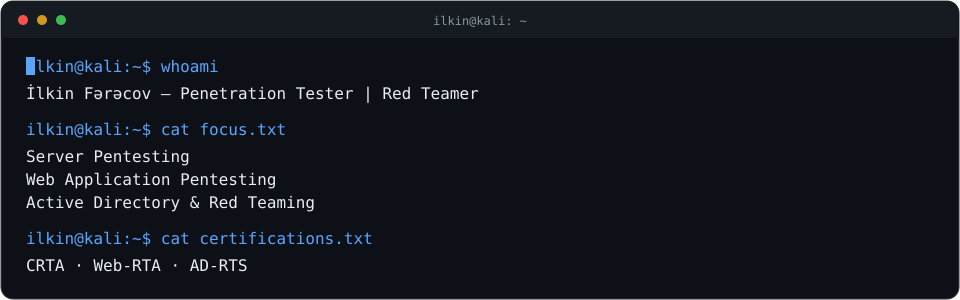

  

## Who am I

I'm **İlkin Fərəcov**, a cybersecurity specialist focused on penetration testing and Red Teaming across servers, web applications, and Active Directory environments. I assess systems from an attacker's perspective, investigating how vulnerabilities can be exploited and what their real-world impact could be.

My approach starts with understanding a system's architecture and how it works. I connect individual findings to analyze potential attack paths, from initial access to privilege escalation and lateral movement.

- **Server Pentesting** — assessing exposed services, known vulnerabilities, misconfigurations, and privilege escalation opportunities on Linux and Windows servers.
- **Web Application Pentesting** — investigating authentication, session management, access control, API security, and business logic vulnerabilities, guided by the OWASP Top 10.
- **Active Directory Pentesting & Red Teaming** — domain enumeration, Kerberos attacks, account and group permissions, lateral movement, and attack chain analysis.

I document findings with reproducible steps and technical evidence, providing remediation guidance based on the level of risk. My goal is to identify vulnerabilities and clearly explain the risks they pose to systems and data.

I hold **CRTA, Web-RTA, and AD-RTS** certifications from **CyberWarFare Labs**. I continue developing my pentesting and Red Team skills through hands-on labs and security research.

My next goal is to earn more advanced professional certifications with practical exams and deepen my experience with complex penetration testing and Red Team scenarios.

---

## Certifications

- **CRTA** — Red Team Analyst · CyberWarFare Labs
- **Web-RTA** — Web Red Team Analyst · CyberWarFare Labs
- **AD-RTS** — Active Directory Red Team · CyberWarFare Labs

## Skill Map

`Web Exploitation` · `Active Directory` · `Recon & OSINT` · `Privilege Escalation` · `Lateral Movement` · `Post Exploitation` · `Tool Development` · `Pentest Reporting`

    

                 

